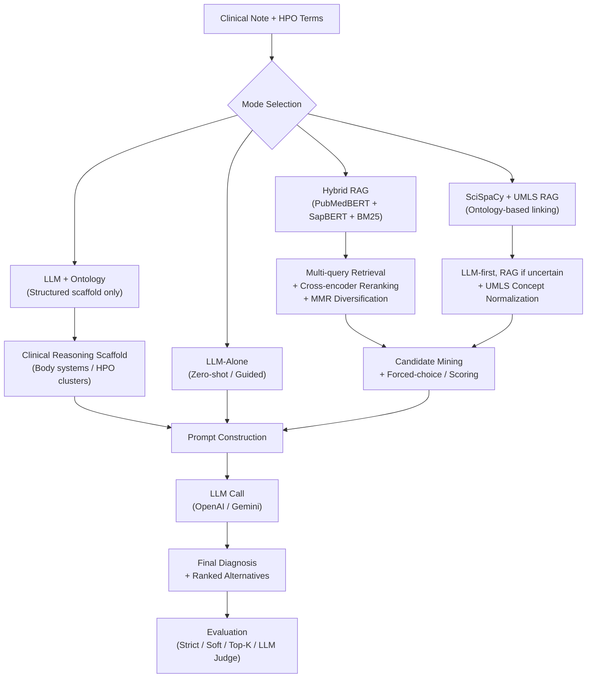

# Assessing LLM Reasoning for Rare Disease Diagnosis Across Ontology and Retrieval-Augmented Approaches

> **Accepted at [vMed 2026] and [ACP (American College of Physicians) 2026]**

**Authors:** Benjamin Liu<sup>1</sup>, Aditi Mod<sup>2,7</sup>, Samhitha Devi Kunadharaju<sup>3,7</sup>, Randy Lim<sup>4,7</sup>, Ryan Bui<sup>5,7</sup>, Kevin Zhu<sup>6,7</sup>

<sup>1</sup> Stanford University &nbsp; <sup>2</sup> University of Illinois Chicago &nbsp; <sup>3</sup> UT Austin &nbsp; <sup>4</sup> New York University &nbsp; <sup>5</sup> UC Irvine &nbsp; <sup>6</sup> UC Berkeley &nbsp; <sup>7</sup> Algoverse AI Research, Palo Alto, CA

**Read Here:** [`docs/MHSR_Submission.pdf`](docs/MHSR_Submission.pdf)

---

## Abstract

Current large language model (LLM) approaches for clinical diagnosis often underrepresent rare diseases within training data, limiting their diagnostic accuracy and generalizability. This study explores retrieval-augmented and ontology-guided approaches to address this limitation, reducing hallucinations and improving the accuracy and interpretability of LLMs in rare-disease reasoning.

We evaluated custom GPT-5-based models on 100 rare-disease diagnostic cases sampled from a corpus with 1,000+ clinical notes, including 5,980 Phenopacket-derived entries, 255 PubMed clinical narratives, and 220 in-house notes from the Children's Hospital of Philadelphia (CHOP). We developed two RAG systems -- a **Hybrid RAG** model combining PubMedBERT embeddings with SAPBERT entity representations, and a **SciSpaCy + UMLS RAG** using ontology-based entity linking and concept normalization -- alongside a standalone LLM + ontology setup.

**Key finding:** The SciSpaCy + UMLS RAG system achieved the highest overall performance (+8% over baseline), while hybrid RAG and ontology-only models degraded accuracy by -15%. UMLS RAG remained stable across retrieval sizes (K=3, 5, 10), whereas hybrid RAG showed retrieval-size sensitivity.

---

## Pipeline Architecture



---

## Repository Structure

```
.
├── llm_diagnosis_pipeline.py      # Core pipeline engine (all modes)
├── run_ablations.py               # CLI wrapper for running preset experiments
├── eval_accuracy.py               # Evaluation metrics + LLM judge
├── corpus_retrieval_patched.py    # FAISS + BM25 retrieval engine
├── rag_scispacy_umls.py           # SciSpaCy/UMLS entity linking & scoring
├── embed_corpus.py                # Build FAISS indexes from corpus
├── cleaning_data.py               # HPO term matching pipeline
├── create_corpus_pubmed_OMIM.py   # Build retrieval corpus from PubMed/OMIM
├── hpo_synonym_map.py             # HPO term synonym dictionary
│
├── configs/                       # JSON configs for each experiment preset
├── modes/                         # Preset builders (12 ablation configurations)
├── prompts/                       # Prompt templates (guided, RAG, ontology, etc.)
├── scripts/
│   ├── run_suite.py               # Batch runner for all presets
│   └── summarize_metrics.py       # Aggregate metrics across experiments
│
├── Datasets/
│   ├── subset.csv                 # Full dataset (~4,700 clinical cases)
│   ├── subset_all_mapped.csv      # Gold-standard evaluation dataset
│   ├── hpo_terms.csv              # HPO term definitions and synonyms
│   ├── toy_cases.csv              # Small test dataset
│   ├── toy_corpus.csv             # Small test corpus
│   ├── json/                      # Clinical reasoning scaffolds
│   ├── indexes/                   # FAISS indexes (generated, not in repo)
│   └── retrieval_corpus/          # Literature corpus (generated, not in repo)
│
├── no_rag.py                      # Legacy notebook: LLM-only baseline
├── rag_n_docs.py                  # Legacy notebook: RAG with PubMed + ChromaDB
├── rag_ontology.py                # Legacy notebook: Ontology-aware RAG
│
├── docs/
│   └── MHSR_Submission.pdf        # Accepted paper (vMed / ACP 2025)
│
├── run_all_improved_5rows.sh      # Run all 12 presets (batch script)
├── run_all_no_cot.sh              # Run all presets without CoT
├── requirements.txt               # Python dependencies
└── requirements-rag.txt           # Additional RAG/embedding dependencies
```

---

## Setup

### 1. Create Environment

```bash
python3 -m venv .venv
source .venv/bin/activate
pip install --upgrade pip
pip install -r requirements.txt
```

**SciSpaCy/UMLS (only needed for the `scispacy_umls` preset):**

```bash
pip install --no-deps "scispacy==0.5.5"
pip install scipy requests conllu joblib "scikit-learn>=0.20.3" pysbd
pip install https://s3-us-west-2.amazonaws.com/ai2-s2-scispacy/releases/v0.5.4/en_core_sci_sm-0.5.4.tar.gz
```

### 2. Configure API Keys

Create a `.env` file in the project root:

```bash
OPENAI_API_KEY=sk-...
OPENAI_MODEL=gpt-5

# Optional: Gemini fallback
# GEMINI_API_KEY=...
# GEMINI_MODEL=gemini-1.5-flash

# Optional: for corpus building scripts
# OMIM_API_KEY=...
# ENTREZ_EMAIL=your-email@example.com
```

### 3. Prepare Data Artifacts

The FAISS indexes and retrieval corpus are not included in the repository due to their size. To generate them:

```bash
# Build the literature corpus from PubMed/OMIM (requires OMIM_API_KEY and ENTREZ_EMAIL)
python3 create_corpus_pubmed_OMIM.py

# Build FAISS indexes from the corpus
python3 embed_corpus.py
```

This will create `Datasets/indexes/pubmedbert.index`, `Datasets/indexes/sapbert.index`, and `Datasets/retrieval_corpus/pmid_mapping.json`.

---

## Running Experiments

### Individual Presets

Each preset corresponds to an ablation configuration from the paper:

| Preset | Description | Command |
|--------|-------------|---------|
| `llm_zero_shot_top5` | LLM zero-shot (top-5 ranked) | `python3 run_ablations.py --preset llm_zero_shot_top5` |
| `llm_guided` | LLM guided CoT | `python3 run_ablations.py --preset llm_guided` |
| `llm_guided_ontology` | LLM guided + ontology scaffold | `python3 run_ablations.py --preset llm_guided_ontology` |
| `semantic_rag_k3` | Semantic RAG (K=3) | `python3 run_ablations.py --preset semantic_rag_k3` |
| `semantic_rag_k5` | Semantic RAG (K=5) | `python3 run_ablations.py --preset semantic_rag_k5` |
| `semantic_rag_k10` | Semantic RAG (K=10) | `python3 run_ablations.py --preset semantic_rag_k10` |
| `hybrid_rag_k3` | Hybrid RAG (K=3) | `python3 run_ablations.py --preset hybrid_rag_k3` |
| `hybrid_rag_k5` | Hybrid RAG (K=5) | `python3 run_ablations.py --preset hybrid_rag_k5` |
| `hybrid_rag_k10` | Hybrid RAG (K=10) | `python3 run_ablations.py --preset hybrid_rag_k10` |
| `rag_cot` | RAG with CoT | `python3 run_ablations.py --preset rag_cot` |
| `ontology_rag_cot` | Ontology-guided RAG CoT | `python3 run_ablations.py --preset ontology_rag_cot` |
| `scispacy_umls` | SciSpaCy + UMLS RAG | `python3 run_ablations.py --preset scispacy_umls` |

Add `--use_llm_judge` for LLM-based equivalence evaluation. Override defaults with `--rows`, `--top_k`, or `--output_file`.

### Full Suite

```bash
python3 scripts/run_suite.py --execute --use_llm_judge
```

Or use the batch scripts:

```bash
bash run_all_improved_5rows.sh   # 12 presets, 10 rows each
bash run_all_no_cot.sh           # 12 presets, 100 rows each
```

### Evaluate Saved Results

```bash
python3 eval_accuracy.py --results Outputs/your_results.csv --use_llm_judge
```

Reports strict match, soft match (substring + Jaccard >= 0.5), containment, coverage, top-5, and LLM judge-adjusted accuracies.

---

## Key Results

| Model | Soft Accuracy | Change vs Baseline |
|-------|:------------:|:-----------------:|
| GPT-5 Baseline | 28% | -- |
| **SciSpaCy + UMLS RAG** | **36%** | **+8%** |
| Hybrid RAG (best at K=5) | ~9.2% | -15% |
| LLM + Ontology Only | ~13% | -15% |

UMLS RAG showed the largest gains in musculoskeletal-neurological (+38%) and neurological-ophthalmologic (+33.3%) categories. See the [full paper](docs/MHSR_Submission.pdf) for detailed results.

---

## Citation

```bibtex
@inproceedings{liu2025assessing,
  title={Assessing Large Language Model Reasoning for Rare Disease Diagnosis Across Ontology and Retrieval-Augmented Approaches},
  author={Liu, Benjamin and Mod, Aditi and Kunadharaju, Samhitha Devi and Lim, Randy and Bui, Ryan and Zhu, Kevin},
  booktitle={Proceedings of vMed / ACP 2025},
  year={2025}
}
```

---

## License

This project is for research purposes. Please cite our work if you use this code or methodology.
